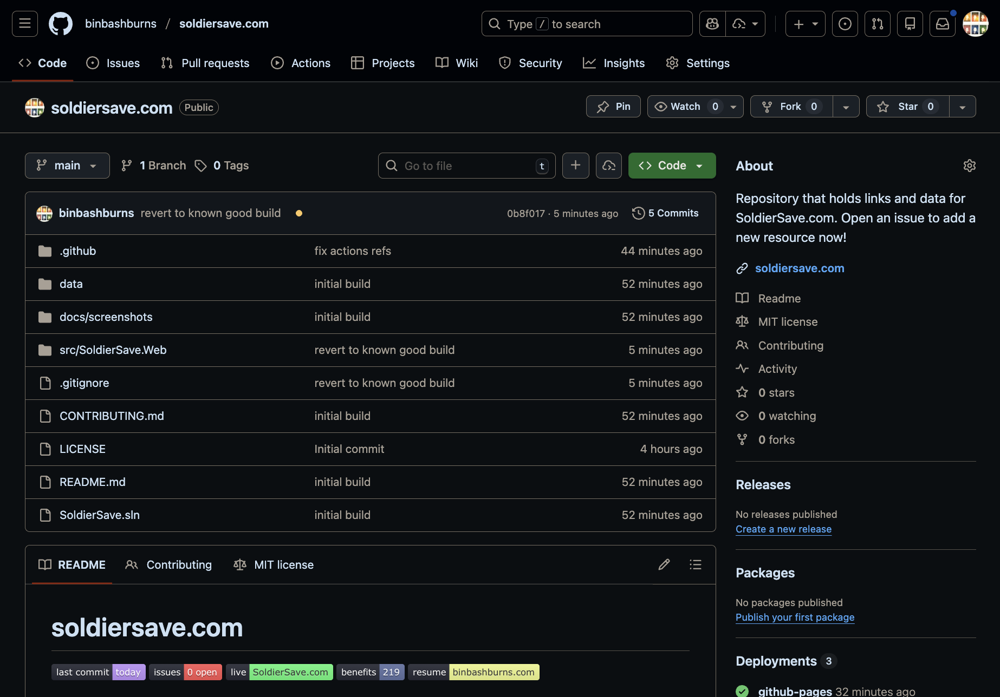
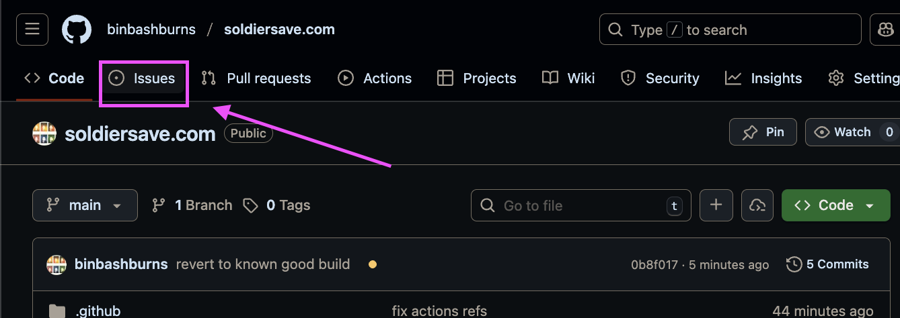
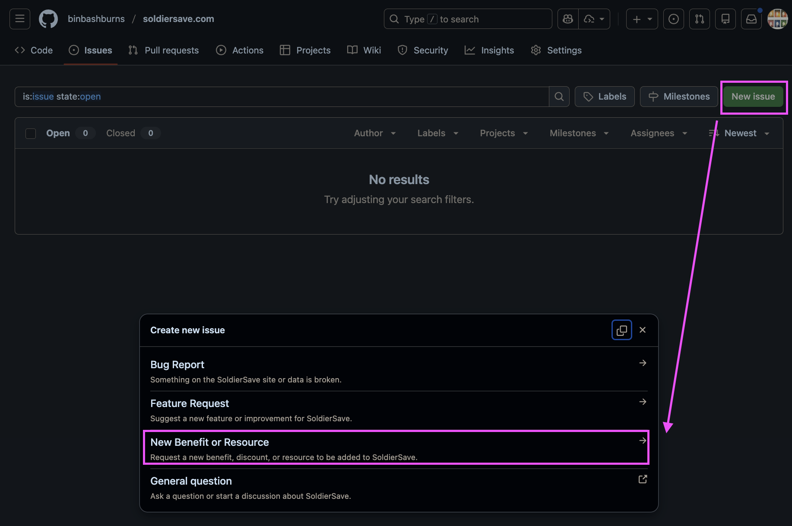
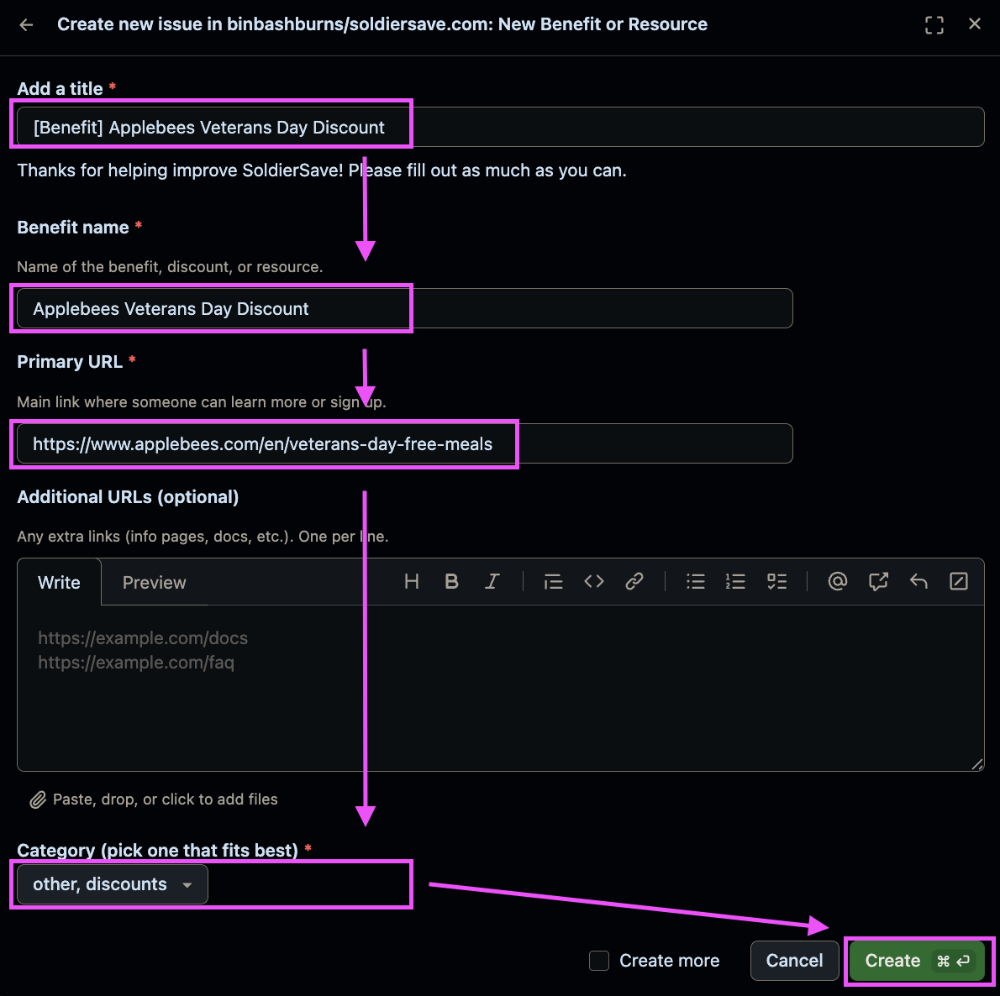

# Contributing to SoldierSave

Thanks for helping improve SoldierSave and making it easier for Soldiers and families to find benefits.

## How to request a new benefit (step‑by‑step)

The easiest way to contribute is by opening a **“New Benefit or Resource”** issue. You do not need to know Git, branches, or pull requests – GitHub does that part for you.

1. **Open the SoldierSave.com repository** [(link)](https://github.com/binbashburns/soldiersave.com)
   - Visit: https://github.com/binbashburns/soldiersave.com

     

2. **Go to the Issues tab**
   - Click the **Issues** tab near the top of the page.

     

3. **Start a “New Benefit or Resource” issue**
   - Click **New issue**.
   - Choose the **“New Benefit or Resource”** template.

     

4. **Fill in the form**
   - Follow the prompts in the issue form. Helpful tips:
     - **Benefit name** – The name of the program, discount, or resource.
     - **Link(s)** – The official URL(s) where a Soldier can read details or sign up.
     - **What kind of benefit is this?** – Brief description (discount, scholarship, travel, etc.).
     - **Who can use this?** – Active duty, Guard/Reserve, veterans, spouses, etc.
     - **Suggested tags** – Short keywords like `discounts`, `travel`, `outdoors`, `veterans-day`, etc.
     - Click **Submit new issue**.

     

5. **What happens behind the scenes**
   - When the issue is created, a GitHub Actions workflow will:
     - Parse the issue form.
     - Append a new entry to `data/benefits.json`.
     - Set:
       - `source.type` to `community`.
       - `source.reference` to `issue-<number>`.
       - `addedBy` to your GitHub handle.
     - Open a pull request on a `new-benefit/issue-<number>` branch with those changes.
   - I (or another maintainer) will then review and merge the PR.

6. **Check your contribution on SoldierSave.com**
   - After the pull request is merged and the site redeploys, your benefit will appear on the homepage and can be searched and filtered by tags.
   - Screenshot placeholder:  
     ``

## Editing benefits data directly

All benefits live in `data/benefits.json`.

Each entry looks roughly like:

```jsonc
{
  "id": "expert-voice",
  "name": "Expert Voice",
  "url": "https://www.expertvoice.com/categories/military/",
  "urls": ["https://www.expertvoice.com/categories/military/"],
  "summary": "Short description of the benefit.",
  "categories": ["discounts", "outdoor"],
  "tags": ["discounts", "outdoor"],
  "eligibility": ["active-duty", "veteran"],
  "source": {
    "type": "community",
    "reference": "issue-123"
  },
  "addedBy": "your-github-username",
  "addedAt": "2025-01-01T00:00:00Z"
}
```

Guidelines:

- Keep `id` unique, lowercase, and hyphenated (no spaces).
- `tags` should be short slugs (e.g., `discounts`, `travel`, `taxes`, `veterans-day`).
- Use your GitHub username (or preferred handle) for `addedBy`.


## Development

To run the site locally:

```bash
dotnet restore
dotnet run --project src/SoldierSave.Web/SoldierSave.Web.csproj
```

Then browse to the URL printed in the console (usually `https://localhost:port`).
