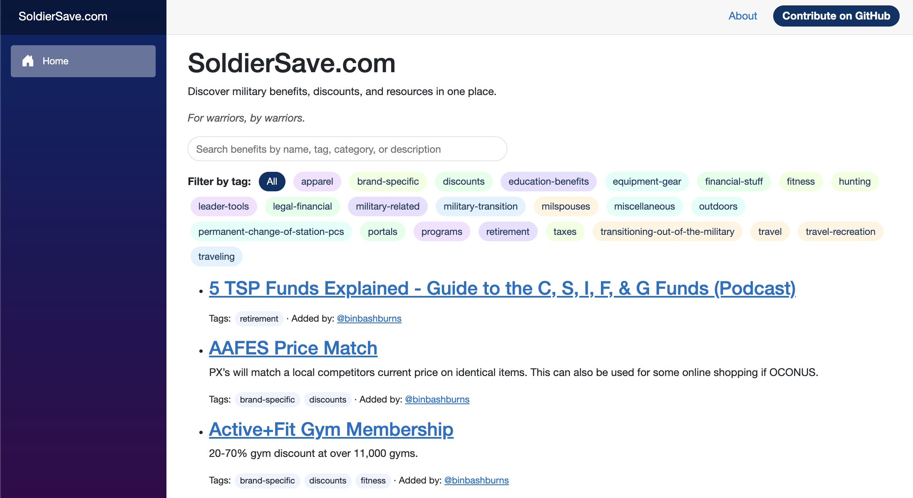
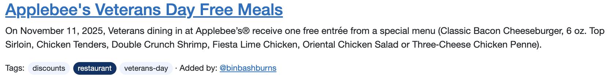
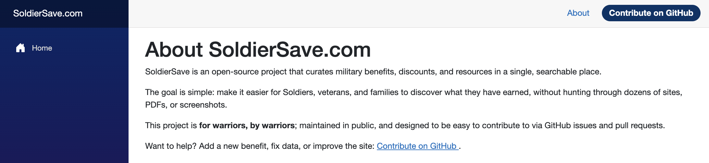

# soldiersave.com

[](https://github.com/binbashburns/soldiersave.com/commits/main)
[](https://github.com/binbashburns/soldiersave.com/issues)
[](https://soldiersave.com)
[](data/benefits.json)
[](https://binbashburns.com)

Repository that holds links and data for SoldierSave. Open an issue to add a new resource now!

## Project layout

- `data/benefits.json` – canonical list of benefits, discounts, and resources.
- `src/SoldierSave.Web` – Blazor WebAssembly frontend (GitHub Pages–friendly).

## Prerequisites

- .NET SDK 9.x installed (`dotnet --version` should show 9.x).

## Running the Blazor site locally

From the repo root (`soldiersave.com` directory):

```bash
cd soldiersave.com
dotnet restore
dotnet run --project src/SoldierSave.Web/SoldierSave.Web.csproj
```

Then open the URL printed in the console (for example `http://127.0.0.1:5xxx`).  
You should see the SoldierSave landing page with tag-based filtering over all benefits.

## Requesting a new benefit (auto-PR flow)

The preferred way to suggest a new benefit, discount, or resource is via a GitHub issue:

- Open a new issue and choose **“New Benefit or Resource”**.
- Fill out the form (name, primary URL, extra URLs, category, tags, eligibility, short description).

When the issue is created:

- A GitHub Actions workflow parses the issue form.
- It automatically:
  - Appends a new entry to `data/benefits.json` (and mirrors it into `src/SoldierSave.Web/wwwroot/data/benefits.json`).
  - Sets:
    - `source.type` to `community`.
    - `source.reference` to `issue-<number>`.
    - `addedBy` to your GitHub handle.
  - Opens a pull request on a branch named `new-benefit/issue-<number>` with the change.

I will then review and merge the PR.

## Suggesting new features

For general improvements or new capabilities (not specific to a single benefit), open a **“Feature Request”** issue:

- Use the user-story format in the template:
  - _“As a &lt;type of user&gt;, I would like &lt;capability&gt; so that &lt;benefit&gt;.”_
- Add any supporting details or examples that clarify what you want.

These issues help shape the roadmap for SoldierSave.com and are the main way to collect feedback and future ideas.

## Automatic link checking

To keep links fresh, a scheduled GitHub Actions workflow runs once a week and checks every URL in `data/benefits.json`:

- For each unique URL, it performs an HTTP request (HEAD with a GET fallback).
- Responses in the 2xx–3xx range are treated as successful.
- Any failures (4xx/5xx responses or network errors) are collected and reported.
- If any broken or suspicious links are found, the workflow automatically opens a GitHub issue labeled:
  - `type:bug`
  - `area:data`
  - `link-check`

## Screenshots

### Landing page with tag filters and search  
  

### Example benefit details + attribution  
  

### About page and “Contribute on GitHub” banner  
  
